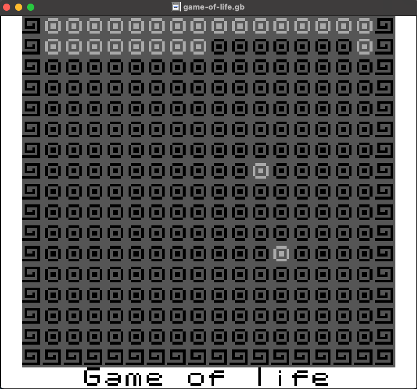

# Conways Game of Life (Gameboy Edition)
This is a small project I'm working on in my freetime to write [Conways Game of Life](https://en.wikipedia.org/wiki/Conway%27s_Game_of_Life) in the z80 assembly variant the gameboy runs. 

As the project stands right now it just displays a basic grid of cells. I haven't had a lot of time to work on it so updates will be sparatic and I may or may not complete the project at all. ¯\\_(ツ)_/¯ 



## Requirements
1. Make - No link because you know what make is
2. [RGBDS](https://github.com/gbdev/rgbds)

## How to run
Option one: just run the make file and get a rom
```
make
cp build/game-of-life.gb wherever you want
```

Option two: if you have sameboy installed just run 
```
./build.sh
```